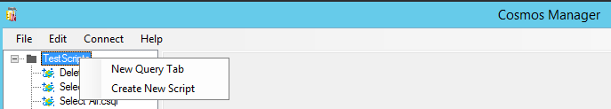
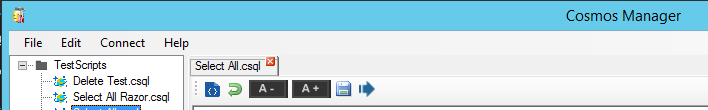
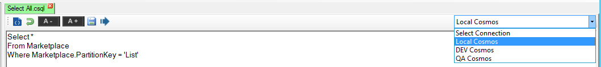
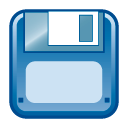
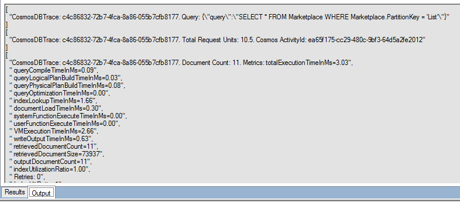
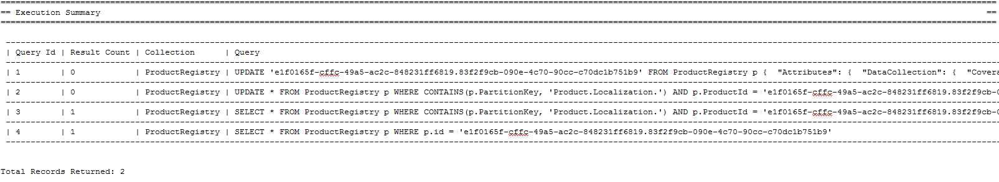
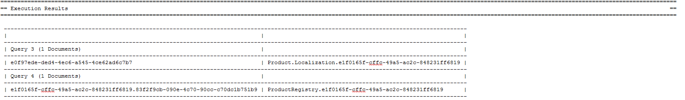

# Cosmos Query Manager for Azure DocumentDB

Cosmos Query Manager is a Windows based query manager for Azure DocumentDb/Cosmos DB

* Develop, run, edit your DocumentDb/Cosmos DB SQL commands
* Add, edit and delete documents
* Work with multiple database and multiple environments
* Transaction and Rollback support

# Install

If you want to install the application please grab the "latest" .EXE installer file from the releases folder in the project source

## Version 2.0 release
This version has some breaking changes that will need to be addressed. 
Due to the relationship between the DocumentDB SDK nuget package (2.9.2) and the Cosmos Emulator the emulator will need to be updated. 
This version of Cosmos Manager works with Cosmos Emulator version 2.7.1.0 or later. When upgrading emulators you will need to reseed the data. 
To do this first export all existing collection data and then re-import it using the dt.exe tool. 
This is needed due to the changes Cosmos Emulator has made to no longer support non-partitioned collections.

# Code base

This is a C# application, requiring VS2017+

# Application Walk-through


## Create a new Query Tab
There are 3 ways to create a new query tab
- From File select


- From the File List View


- From double clicking in the tabs bar



## Working with existing query files
You can open any directory folder to load all the .cSQL files. This also loads all children folders and files as well. This provides the easy of working across many files, but still being able to organize them.

## Loading Connections
To create the connections file view the Help Guide.


### Changing connections
In the query options toolbar on the far right is a dropdown to change the connection string of where the query gets executed. Each connection string will color the current tab to a set color. This helps in keeping track of what environment a query has been ran against at a quick glance.



## Query Options

-  Formats the query statement
-  Selected text to lowercase
- Selected text to uppercase
-  Indents LIne
-  Outdents Line
-  Controls word wrap of the query statement
-   Changes the font size of the query statement
-  Saves the query statement
-  Runs the query statement

## Result Options
On selects we have options available to manipulate the results list

-  Send all the selected documents to a New Query Update statement
-  Send all the selected documents to a New Query Delete statement


## Single Document Options

-  Formats the document
-  Selected text to lowercase
-  Selected text to uppercase
-  Indents LIne
-  Outdents Line
-  Controls word wrap of the document
-   Changes the font size of the document
-  Deletes the document
-  Saves the document
-  Exports the results document

## Query Output
In the output tab we can see all information related to the executed query. On selects we output all the cosmos metrics and costs, on other queries information related to the success of the query are displayed.



## Transaction Cache
The transaction cache is the storage location where rollback files are stored. The application never deletes from this folder so there is always a rollback 
history available as a data safety precaution. As this folder grows with backup data for transactions it may need to be cleaned out or have the files archived somewhere.

# Commandline Support (v2.0)
Cosmos Manager now provides commandline support. This can be used to automate CosmosDB updates as part of a release or deployment cycle.
One of the challenges with using Cosmos is the lack of automation and transaction ability when changing data within CosmosDB. By using this through the commandline you now have that control.

### Options
| Options| Description |
| -----
| --connections | The JSON file that contains all the CosmosDB connections information. |
| --connectTo | he name of the connection to use to connect to CosmosDB. |
| --script | The .CSQL script to execute. |
| --folder | The folder that contains the .CSQL scripts to execute. |
| --output | The .CResult file the query output is written to. |
| --continueOnError | Flag to indicate whether to continue script executions on error.|
| --ignorePrompts | Flag to indicate whether to continue without accepting user input on prompts. Used for executing data altering scripts without transactions. |
| --includeDocumentInOutput | Flag to indicate whether to write the document results to the console and output file. |

### Examples

#### Get Help
```CMD
CosmosManager2019.exe exec --help
```

#### Run a single script
```CMD
CosmosManager2019.exe exec --connections "C:\TestScripts\connections.json" --connectTo "Local Cosmos" --script "C:\TestScripts\FindMyUserId.csql" --output "C:\TestScripts\output.cresult"
```

#### Run all scripts in a folder
```CMD
CosmosManager2019.exe exec --connections "C:\TestScripts\connections.json" --connectTo "Local Cosmos" --folder "C:\TestScripts\" --includeDocumentInOutput --output "C:\TestScripts\output.cresult"
```

### Output
Currently text display output is the only option. It provides all the CossmmosDB metrics and execution summaries and results.

#### Sample Execution Summary

 

#### Sample Execution Result

 